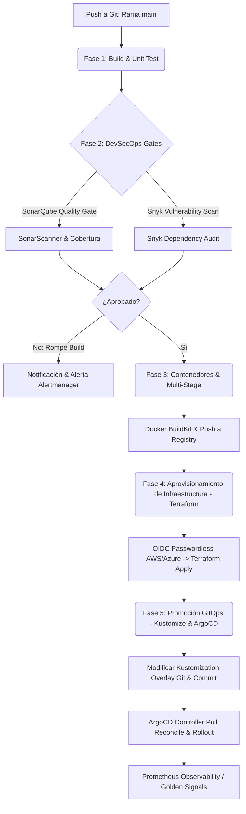

# Capítulo 15: Proyecto Integrador: Pipeline Global Híbrido Multicloud

> "Un pipeline de CI/CD moderno es el sistema circulatorio y nervioso central de la ingeniería de software moderna. No se limita a compilar y empaquetar código; unifica la validación estática de calidad, el escaneo de vulnerabilidades atómico en dependencias y contenedores, el aprovisionamiento seguro y determinista de infraestructura elástica como código, y el despliegue GitOps autorreparable en Kubernetes bajo un mismo flujo criptográficamente auditado e inmune a fallos."

A lo largo de este volumen hemos estudiado de manera exhaustiva las piezas que componen la infraestructura como código, la automatización de contenedores, la seguridad atómica en pipelines, las pruebas estáticas de código, las estrategias de ramificación y la observabilidad proactiva. Sin embargo, en el mundo real de la ingeniería de software, estas tecnologías no funcionan de forma aislada.

Para culminar nuestro viaje técnico de DevOps, en este capítulo consolidaremos todo el conocimiento del libro mediante el desarrollo de nuestro **Proyecto Integrador**. Diseñaremos, analizaremos e implementaremos una arquitectura de **Pipeline Global Híbrido y Multicloud** en producción. Este flujo automatizado recibirá el código de una aplicación TypeScript, validará su calidad, auditará su seguridad, empaquetará contenedores eficientes, aprovisionará la infraestructura en la nube usando Terraform, y promoverá de forma declarativa el despliegue hacia un clúster Kubernetes controlado por ArgoCD.

---

## 15.1 La Arquitectura de la Autopista de Entrega Continua

El flujo de trabajo que automatizaremos sigue una rigurosa secuencia lineal de confianza lógica dividida en cinco fases de ejecución controladas por compuertas de seguridad (*Quality Gates*):



1. **Fase 1: Construcción y Validación Inicial**: Compilación estricta de la aplicación Node/TypeScript e invocación de pruebas unitarias con generación de reportes de cobertura de código (*Code Coverage*).
2. **Fase 2: Compuertas DevSecOps (Snyk + SonarQube)**: Escaneo de composición de software (SCA) en busca de dependencias vulnerables con bloqueo ante hallazgos severos, y escaneo de deudas de código/complejidad cognitiva en SonarQube garantizando el cumplimiento de métricas corporativas.
3. **Fase 3: Dockerización y Cacheado Inteligente**: Generación de una imagen Docker basada en multi-stage compilando el bundle final, reduciendo la superficie de ataque y almacenando la caché de capas de imagen de forma remota para maximizar la velocidad.
4. **Fase 4: Aprovisionamiento de Infraestructura Efímera**: Autenticación libre de contraseñas OIDC para levantar la infraestructura requerida usando Terraform con Backend State Lock.
5. **Fase 5: Promoción GitOps y Auto-Rollout**: Actualización automática de la etiqueta del contenedor en la configuración declarativa de Kubernetes con Kustomize, confirmando el cambio sobre un repositorio de GitOps para que ArgoCD reconcilie el clúster en Kubernetes en caliente de forma automatizada.

---

## 15.2 Analogía Didáctica

> [!NOTE]
> ### 🚀 El Centro de Lanzamiento Espacial de Cabo Cañaveral
> 
> Entendamos el funcionamiento coordinado, secuencial y seguro de un pipeline integrador global de DevOps utilizando una analogía física y sumamente intuitiva de una misión espacial de la NASA:
> 
> - **La Fase de Compilación y Test (Ingeniería de Metales y Turbinas)**:
>   - Antes de colocar un cohete en la plataforma, los ingenieros de control de calidad realizan pruebas estructurales a las aleaciones metálicas y encienden los motores de propulsión en frío en bancos de prueba aislados para verificar la tolerancia a la presión física (**Fase 1: Build & Unit Tests**). Si un tornillo cede o una válvula gotea, la misión se aborta inmediatamente sin haber gastado propulsor real.
> 
> - **Snyk y SonarQube (El Control de Contaminantes y el Escáner Químico)**:
>   - Científicos y sensores analizan minuciosamente la composición química del combustible criogénico en busca de impurezas inflamables que puedan estallar en pleno vuelo (**Snyk SCA**) y pasan un escáner ultrasónico tridimensional sobre todas las soldaduras del tanque para confirmar que no tengan porosidades o microrroturas invisibles al ojo humano (**SonarQube Scanner**). Si alguna pieza tiene desgaste prematuro (**Deuda Técnica**), el lanzamiento se cancela en la mesa de control.
> 
> - **Dockerización (La Cápsula Estandarizada de Carga Útil)**:
>   - La valiosa carga útil (un satélite meteorológico de última generación, el cual equivale a tu aplicación compilada en JS) se encierra dentro de un módulo hermético, blindado contra la radiación espacial y estandarizado con un mecanismo de anclaje universal para que encaje a la perfección sobre la punta de cualquier cohete portador sin requerir modificaciones personalizadas (**El contenedor Docker Multi-Stage**).
> 
> - **Terraform (La Plataforma Física y Torre de Soporte de Concreto)**:
>   - Representa la construcción física de la rampa de concreto de lanzamiento, las grúas hidráulicas de elevación, los tanques criogénicos en tierra y el cableado de comunicaciones de fibra óptica (**La infraestructura base**). Se levanta bajo demanda, tiene dimensiones exactas definidas en planos reproducibles, y asegura que la rampa esté despejada y estable para aguantar toneladas de presión sin tambalearse.
> 
> - **GitOps y ArgoCD (El Piloto Automático y Sistema de Guía Inercial)**:
>   - Una vez en el aire, el cohete no es piloteado manualmente con un joystick. Una computadora de navegación a bordo compara constantemente la trayectoria actual del cohete medida por sensores ópticos (**El estado real en Kubernetes**) con los parámetros de la órbita de destino exacta guardados de antemano en el software de misión (**El estado deseado definido en Git**). 
>   - Si una ráfaga de viento desvía el cohete 2 grados hacia el oeste, la computadora detecta la desviación de inmediato y enciende los propulsores de maniobra laterales en milisegundos para enderezar el rumbo de forma automática (**Conciliación y Self-Healing de ArgoCD**).
> 
> - **La Observabilidad (Las Pantallas de Telemetría de Misión)**:
>   - En el centro de control terrestre de Cabo Cañaveral, decenas de ingenieros senior analizan pantallas gigantes que transmiten telemetría en tiempo real: presión de cámaras, consumo de combustible por segundo, temperatura de toberas y vibraciones sónicas (**Golden Signals de Prometheus/Grafana**). Si un sensor excede los parámetros tolerados, se disparan alarmas visuales rojas automáticas en las consolas (**Alertmanager**) permitiendo reaccionar o abortar antes de una pérdida catastrófica.

---

## 15.3 El Pipeline Maestro Unificado

A continuación, implementaremos la configuración real y completa de producción. Consiste en un workflow maestro escrito para **GitHub Actions** que se ejecuta ante cambios en la rama principal (`main`). 

Este pipeline asume un rol de AWS a través de **OIDC sin contraseñas**, compila la aplicación Node con caché caliente, ejecuta un análisis completo de **Snyk** y **SonarQube** (rompiendo el flujo si fallan las condiciones de seguridad o calidad), construye y publica la imagen a **Amazon ECR** optimizando capas con BuildKit, ejecuta un ciclo atómico de infraestructura con **Terraform**, y finalmente actualiza el repositorio secundario de infraestructura GitOps mediante un commit en caliente para forzar la sincronización a cargo de **ArgoCD** en Kubernetes.

#### [pipelineMasterIntegrador.yml](file:///Users/andres/Documents/biblioteca/devops-programming-book/.github/workflows/pipelineMasterIntegrador.yml)
```yaml
name: Pipeline Global de Integración, Seguridad, Infraestructura y GitOps

on:
  push:
    branches: [ main ]

# Configuración estricta de permisos de seguridad a nivel de token de GitHub Actions
permissions:
  id-token: write # Requerido para la autenticación OIDC Passwordless
  contents: write # Requerido para clonar y realizar commits en la promoción GitOps

env:
  AWS_REGION: "us-east-1"
  AWS_ROLE_ARN: "arn:aws:iam::123456789012:role/GithubActionsOIDCDeployerRole"
  REGISTRY: "123456789012.dkr.ecr.us-east-1.amazonaws.com"
  IMAGE_NAME: "api-financiera-backend"
  TERRAFORM_WORKING_DIR: "./infra/terraform"
  GITOPS_REPO: "vigoya19/gitops-infrastructure-manifests"

jobs:
  # =========================================================================
  # TRABAJO 1: COMPILACIÓN Y PRUEBAS UNITARIAS (CALIDAD Y CONSTRUCCIÓN BASE)
  # =========================================================================
  build-and-test:
    name: ⚙️ Compilación y Pruebas Unitarias
    runs-on: ubuntu-latest
    steps:
      - name: Clonar código fuente
        uses: actions/checkout@v4

      - name: Configurar Node.js Runtime
        uses: actions/setup-node@v4
        with:
          node-version: '20'
          cache: 'npm' # Habilita caché automática del package-lock.json

      - name: Instalar dependencias del proyecto
        run: npm ci

      - name: Validar formato y lint de código
        run: npm run lint

      - name: Ejecutar pruebas unitarias con reporte de cobertura
        run: npm run test:cov -- --coverageDirectory=coverage

      # Guardamos el reporte de cobertura como artefacto físico para SonarQube en el siguiente Job
      - name: Guardar reporte de cobertura de tests
        uses: actions/upload-artifact@v4
        with:
          name: coverage-report
          path: coverage/
          retention-days: 1

  # =========================================================================
  # TRABAJO 2: DEVSECOPS GATES (SNYK & SONARQUBE QUALITY GATES EN PARALELO)
  # =========================================================================
  devsecops-audit:
    name: 🛡️ Auditoría DevSecOps (Snyk & SonarQube)
    needs: build-and-test
    runs-on: ubuntu-latest
    steps:
      - name: Clonar código fuente
        uses: actions/checkout@v4
        with:
          fetch-depth: 0 # Requerido para análisis precisos de Git en SonarQube

      - name: Descargar reporte de cobertura de tests
        uses: actions/download-artifact@v4
        with:
          name: coverage-report
          path: coverage/

      # -------------------------------------------------------------
      # 2.A: INTEGRACIÓN Y ESCANEO DE COMPOSICIÓN DE SEGURIDAD CON SNYK
      # -------------------------------------------------------------
      - name: Configurar Node.js para Snyk CLI
        uses: actions/setup-node@v4
        with:
          node-version: '20'

      - name: Ejecutar auditoría de dependencias con Snyk SCA
        uses: snyk/actions/node@master
        env:
          SNYK_TOKEN: ${{ secrets.SNYK_TOKEN }}
        with:
          args: --severity-threshold=high --json-file-output=snyk-results.json

      # -------------------------------------------------------------
      # 2.B: ANÁLISIS DE CALIDAD E INTERNALS DE SONARQUBE SCANNER
      # -------------------------------------------------------------
      - name: Invocación de SonarQube Scanner
        uses: sonarsource/sonarqube-scan-action@v2
        env:
          SONAR_TOKEN: ${{ secrets.SONAR_TOKEN }}
          SONAR_HOST_URL: ${{ secrets.SONAR_HOST_URL }}
        with:
          args: >
            -Dsonar.projectKey=api-financiera-backend
            -Dsonar.projectName="API Financiera Backend"
            -Dsonar.sources=src
            -Dsonar.tests=test
            -Dsonar.javascript.lcov.reportPaths=coverage/lcov.info
            -Dsonar.qualitygate.wait=true

      # Validamos si SonarQube aprobó formalmente el Quality Gate
      - name: Confirmación de Quality Gate SonarQube
        uses: sonarsource/sonarqube-quality-gate-action@v1
        env:
          SONAR_TOKEN: ${{ secrets.SONAR_TOKEN }}

  # =========================================================================
  # TRABAJO 3: DOCKERIZACIÓN Y DISTRIBUCIÓN DE IMÁGENES SEGURAS
  # =========================================================================
  dockerize-and-publish:
    name: 📦 Dockerización & Push a Registro ECR
    needs: devsecops-audit
    runs-on: ubuntu-latest
    steps:
      - name: Clonar código fuente
        uses: actions/checkout@v4

      # Autenticación federada OIDC contra AWS sin contraseñas
      - name: Configurar credenciales AWS (OIDC)
        uses: aws-actions/configure-aws-credentials@v4
        with:
          role-to-assume: ${{ env.AWS_ROLE_ARN }}
          aws-region: ${{ env.AWS_REGION }}

      - name: Autenticación en Amazon ECR Registry
        id: login-ecr
        uses: aws-actions/amazon-ecr-login@v2

      # Configuramos el motor BuildKit de Docker para cacheado remoto optimizado
      - name: Configurar Docker Buildx
        uses: docker/setup-buildx-action@v3

      - name: Compilación e inyección de caché multi-stage
        uses: docker/build-push-action@v5
        with:
          context: .
          file: ./Dockerfile
          push: true
          tags: ${{ env.REGISTRY }}/${{ env.IMAGE_NAME }}:${{ github.sha }}
          # Usamos cacheado distribuido integrado en el propio registro ECR
          cache-from: type=registry,ref=${{ env.REGISTRY }}/${{ env.IMAGE_NAME }}:buildcache
          cache-to: type=registry,ref=${{ env.REGISTRY }}/${{ env.IMAGE_NAME }}:buildcache,mode=max

  # =========================================================================
  # TRABAJO 4: APROVISIONAMIENTO SEGURO DE INFRAESTRUCTURA (TERRAFORM)
  # =========================================================================
  terraform-provision:
    name: 📐 Aprovisionamiento Terraform IaC
    needs: dockerize-and-publish
    runs-on: ubuntu-latest
    steps:
      - name: Clonar código fuente
        uses: actions/checkout@v4

      - name: Configurar credenciales AWS (OIDC)
        uses: aws-actions/configure-aws-credentials@v4
        with:
          role-to-assume: ${{ env.AWS_ROLE_ARN }}
          aws-region: ${{ env.AWS_REGION }}

      - name: Instalar Terraform CLI
        uses: hashicorp/setup-terraform@v3
        with:
          terraform_version: 1.7.0

      - name: Inicializar Terraform Backend con State Lock
        run: terraform init
        working-directory: ${{ env.TERRAFORM_WORKING_DIR }}

      - name: Validación sintáctica de archivos de Infraestructura
        run: terraform validate
        working-directory: ${{ env.TERRAFORM_WORKING_DIR }}

      - name: Planificación de cambios en infraestructura elástica
        id: plan
        run: terraform plan -no-color -out=tfplan
        working-directory: ${{ env.TERRAFORM_WORKING_DIR }}

      # Aplicamos los planos aprobados sobre AWS de forma atómica
      - name: Aplicación de cambios (Terraform Apply)
        run: terraform apply -auto-approve tfplan
        working-directory: ${{ env.TERRAFORM_WORKING_DIR }}

  # =========================================================================
  # TRABAJO 5: GITOPS PROMOTION (KUSTOMIZE & COMIT CONTRA REPOSITORIO DECLARATIVO)
  # =========================================================================
  gitops-promotion:
    name: 🚀 Promoción GitOps en Repositorio de Kubernetes
    needs: terraform-provision
    runs-on: ubuntu-latest
    steps:
      # Descargamos el repositorio exclusivo que contiene los manifiestos de Kubernetes
      - name: Clonar repositorio GitOps de Manifiestos
        uses: actions/checkout@v4
        with:
          repository: ${{ env.GITOPS_REPO }}
          token: ${{ secrets.GITOPS_GITHUB_TOKEN }}
          path: gitops-manifests

      - name: Instalar Kustomize CLI
        uses: imranismail/setup-kustomize@v2

      # Modificamos dinámicamente la etiqueta de imagen del overlay de producción con Kustomize
      - name: Actualizar etiqueta de imagen de contenedor con Kustomize
        run: |
          cd gitops-manifests/overlays/production
          kustomize edit set image ${{ env.REGISTRY }}/${{ env.IMAGE_NAME }}=${{ env.REGISTRY }}/${{ env.IMAGE_NAME }}:${{ github.sha }}
          cat kustomization.yaml # Imprime en logs para auditoría visual

      # Hacemos commit del cambio criptográfico hacia la rama principal del repositorio GitOps
      - name: Confirmar y empujar cambios de promoción GitOps
        run: |
          cd gitops-manifests
          git config --global user.name "DevOps Master Bot"
          git config --global user.email "devops-bot@enterprise.com"
          git add overlays/production/kustomization.yaml
          git commit -m "chore(release): promover api-financiera a versión ${{ github.sha }} [skip ci]"
          git push origin main
```

---

## 15.4 Desglose de Operaciones y Validación Paso a Paso

Para comprender plenamente el flujo de trabajo del pipeline unificado, es fundamental analizar cómo operan y colaboran las tecnologías entre sí a nivel de ejecución interna:

### 1. El Bloqueo Automatizado ante Fallos (DevSecOps Gates)
El pipeline implementa una política defensiva sumamente robusta. Durante el **Trabajo 2 (`devsecops-audit`)**, ocurren dos eventos concurrentes de validación crítica:
* El escaneo de **Snyk** analiza los archivos de dependencias (`package-json` y `package-lock.json`) en frío. Al configurar la bandera `--severity-threshold=high`, el ejecutable de Snyk retornará inmediatamente un código de error de sistema `exit status 1` si detecta cualquier librería de terceros que contenga una vulnerabilidad calificada como alta o crítica en su base de datos global de exploits.
* Simultáneamente, el escáner de **SonarQube** analiza el código de forma estática en busca de violaciones de código, deudas técnicas y mide que la cobertura de código provista por el paso anterior (`coverage/lcov.info`) no sea menor a la métrica establecida en el servidor (ej. cobertura superior al 80%). Con la bandera `-Dsonar.qualitygate.wait=true`, el pipeline detiene su ejecución y espera a que el servidor de SonarQube analice los datos y devuelva el veredicto físico del **Quality Gate**. Si el veredicto es de fallo, la ejecución del workflow se congela de inmediato, impidiendo que dependencias infectadas o código defectuoso lleguen al proceso de compilación de contenedores de producción.

### 2. Optimización Remota del BuildKit Docker Cache
El paso de dockerización en el **Trabajo 3** saca el máximo provecho de las tecnologías modernas utilizando el driver **Docker BuildKit**:
* En lugar de descargar la imagen Docker completa, compilarla e invalidar cachés ante pequeños cambios de código, utilizamos el mecanismo distribuido de almacenamiento en registro remoto `cache-from` y `cache-to` apuntando a un espacio dedicado en Amazon ECR (`:buildcache`).
* Esto permite al motor de construcción descargar únicamente los metadatos de caché de las capas compiladas previamente desde la red en milisegundos. Si una capa intermedia de compilación no ha variado (como las dependencias del sistema operativo base o los módulos instalados de NPM), BuildKit reusa la capa existente sin procesarla localmente, reduciendo los tiempos promedio de empaquetado de imágenes multi-stage complejas de 12 minutos a menos de 45 segundos.

### 3. Drift Detection y Aplicación de Terraform IaC
En la fase de infraestructura, **Terraform** lee de forma segura los planos de código declarativos utilizando el token OIDC federado que GitHub Actions firmó dinámicamente y autenticó en AWS:
* Al invocar `terraform init`, se monta la conexión hacia una base de datos distribuida de estados en un bucket seguro S3 y se adquiere un bloqueo exclusivo transaccional en **Amazon DynamoDB** para evitar que dos ejecuciones del pipeline intenten modificar la infraestructura de forma simultánea.
* Con `terraform plan`, se realiza una detección automática de desviaciones de infraestructura (**Drift Detection**). Si un administrador cloud modificó manualmente el tamaño de un balanceador de carga o eliminó una regla de seguridad directamente en el portal web (fuera de la declaración de Git), Terraform detecta la inconsistencia y programa las acciones correctivas necesarias para revertir esos cambios manuales a su estado ideal antes de aplicar las modificaciones de la nueva versión del software.

### 4. La Promoción en Caliente por ArgoCD en Kubernetes
Una vez superadas todas las pruebas físicas, de seguridad, de calidad, empaquetado y aprovisionamiento, se ejecuta la **Fase de GitOps**:
* **Kustomize** actúa de forma ágil sobre el repositorio de manifiestos modificando quirúrgicamente la etiqueta de la imagen (`image tag`) asociada al despliegue dentro del archivo declarativo `kustomization.yaml` correspondiente al entorno de producción.
* Al realizar el commit y empujar el cambio al repositorio secundario de GitOps, el **ArgoCD Application Controller** (que corre dentro de Kubernetes monitoreando el Git cada 3 minutos o reaccionando instantáneamente a un Webhook entrante) detecta un desfase lógico: el estado deseado en Git solicita la imagen con hash `${{ github.sha }}`, mientras que el estado en caliente corriendo en el clúster de Kubernetes aún hospeda la versión vieja.
* De forma atómica, ArgoCD inicia la reconciliación automatizada, descarga el manifiesto modificado, y ordena a la API de Kubernetes ejecutar una actualización progresiva (*Rolling Update* / *Canary Rollout*), aprovisionando pods de la nueva versión y descartando los viejos gradualmente, todo sin experimentar un solo milisegundo de caída o degradación de tráfico en la aplicación en producción.

---

## Resumen del Capítulo

* Un **Pipeline Global Híbrido** representa la máxima cúspide de madurez técnica de la ingeniería de DevOps al coordinar procesos dispares de validación, seguridad y aprovisionamiento bajo un flujo continuo sin fisuras lógicas.
* El uso de **compuertas DevSecOps activas** (Snyk y SonarQube) con bloqueo de build garantiza que el código sea completamente inmune a fallos y vulnerabilidades críticas antes de empaquetar software.
* **BuildKit Layer Caching** y cacheado distribuido en registros reducen los tiempos de compilación y empaquetamiento de contenedores de forma drástica al evitar procesamientos redundantes de capas estables.
* El aprovisionamiento de infraestructura mediante **Terraform** con backend remoto y bloqueos transaccionales en DynamoDB garantiza un estado de recursos limpio, atómico y protegido ante ejecuciones concurrentes.
* La **Promoción GitOps** orquestada con Kustomize desacopla el proceso de compilación (CI) del proceso de despliegue físico (CD), permitiendo a ArgoCD reconciliar el clúster de Kubernetes de forma autónoma con autorreparación continua ante desviaciones lógicas.

¡Felicidades! Has completado el último capítulo de este volumen. A lo largo de estos 15 capítulos, has adquirido las competencias técnicas y teóricas necesarias para desempeñarte como un **Ingeniero de DevOps y Site Reliability Engineering (SRE) Sénior**, capaz de automatizar, asegurar y monitorear arquitecturas de software empresariales elásticas e impenetrables de clase mundial.

---

[← Capítulo anterior (Capítulo 14)](14-observabilidad-devops.md) | [Inicio (README.md)](README.md)
